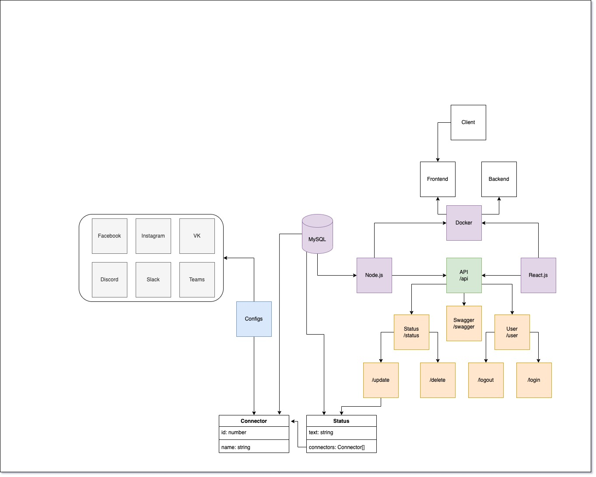

# Status Joiner



## Useful links

- [Figma](https://www.figma.com/file/4VblKaeQnFwIMrBPlfPK0c/Status-joiner?node-id=0%3A1)

## API docs

### Teams

- [Authorization](https://docs.microsoft.com/ru-ru/graph/auth-v2-user?context=graph%2Fapi%2F1.0&view=graph-rest-1.0)
- [Statuses](https://docs.microsoft.com/ru-ru/graph/api/presence-get?view=graph-rest-1.0&tabs=http#code-try-1)

- Set status

```javascript
fetch("https://presence.teams.microsoft.com/v1/me/forceavailability/", {
  headers: {
    accept: "json",
    authorization: "Bearer TOKEN_HERE",
    Referer: "https://teams.microsoft.com/",
    "Referrer-Policy": "strict-origin-when-cross-origin",
    "cache-control": "no-cache",
    "content-type": "application/json",
  },
  body: '{"availability":"Available"}',
  method: "PUT",
});
```

- Set status text

```javascript
fetch("https://presence.teams.microsoft.com/v1/me/publishnote", {
  headers: {
    accept: "json",
    "accept-language": "en-US,en;q=0.9,ru-RU;q=0.8,ru;q=0.7",
    authorization: "Bearer TOKEN_HERE",
    "cache-control": "no-cache",
    "content-type": "application/json",
  },
  body: '{"message":"text","expiry":"2021-11-26T20:59:59.999Z"}',
  method: "PUT",
});
```

### Slack

- [Statuses](https://api.slack.com/docs/presence-and-status)

### VKontakte

- [Statuses](https://vk.com/dev/status)
